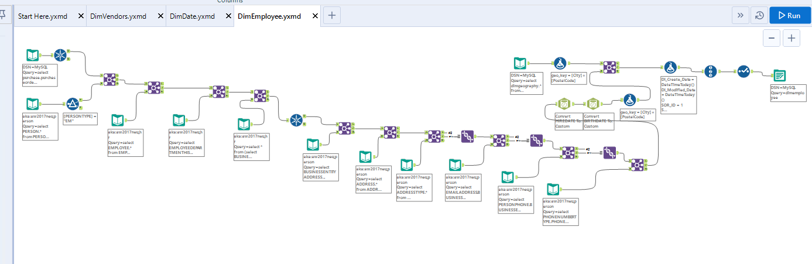
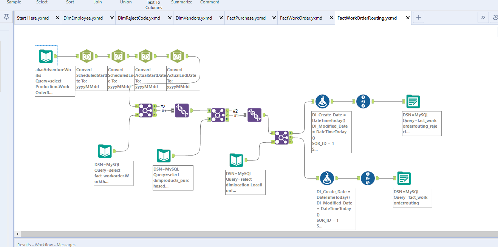
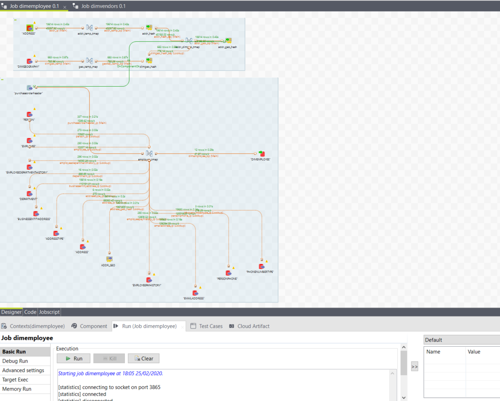
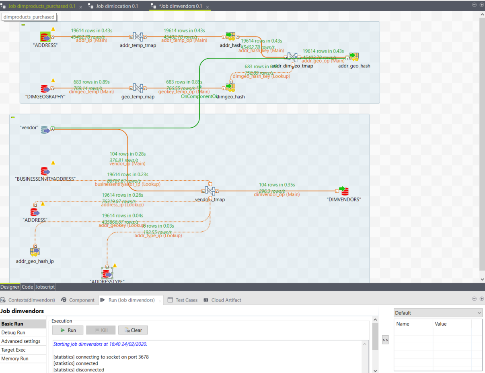
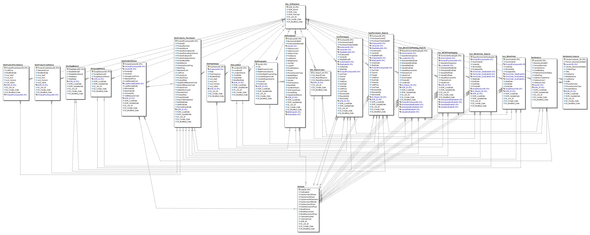

# AdventureWorks-Retail-Store-DW-and-BI-Using-Altreyx-and-Talend-
Data Warehousing and Business Intelligence performed over a Retail Store's Dateset

Follow the steps for installation:

1. Install and setup Oracle 11g, MySQL Workbench, Postgres and SQL Server

2. Install Alteryx, Talend, PowerBI and ER Studio

3. Run the SQL Scripts to create tables

4. Run all the Jobs in Atreyx and Talend

5. Use PowerBI to see the visualizations of the data

# Sample Altreyx Jobs created in the project:

# Sample Talend Jobs created in the project:

# ER Model generated by the using ER Studio for generating DDL scripts 

